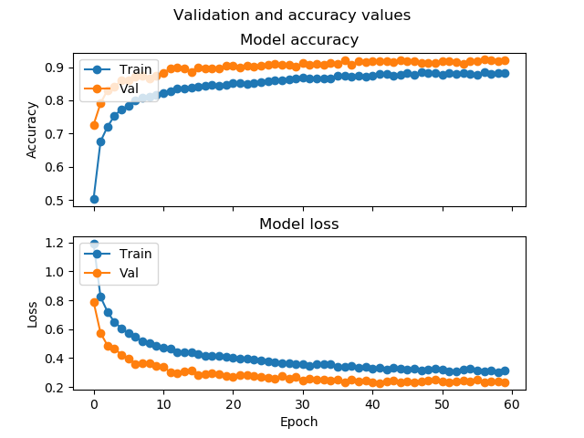
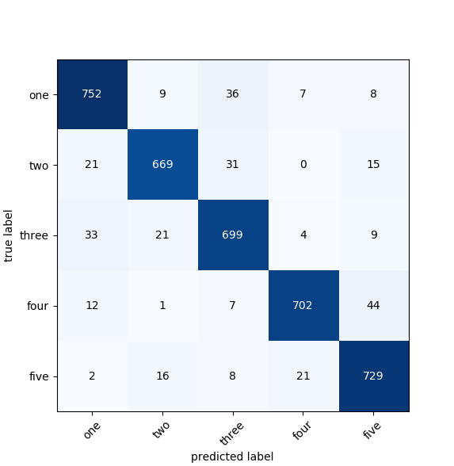

Spoken words recognition with TensorFlow 2.0
========================================

## Speech Commands Data Set v0.02

This is a set of one-second .wav audio files, each containing a single spoken
English word. These words are from a small set of commands, and are spoken by a
variety of different speakers. The audio files are organized into folders based
on the word they contain, and this data set is designed to help train simple
machine learning models. This dataset is covered in more detail at [https://arxiv.org/abs/1804.03209](https://arxiv.org/abs/1804.03209).

It's licensed under the [Creative Commons BY 4.0
license](https://creativecommons.org/licenses/by/4.0/). See the LICENSE
file in this folder for full details. Its original location was at
[http://download.tensorflow.org/data/speech_commands_v0.02.tar.gz](http://download.tensorflow.org/data/speech_commands_v0.02.tar.gz).


## Sound samples
Sound samples are processed to MFCCs and used as input matrix of shape (16,44) 

 


## Model

Model is composed of two Dense layers with Dropouts for regularization 

```shell
Model: "sequential_22"
_________________________________________________________________
Layer (type)                 Output Shape              Param #   
=================================================================
flatten_16 (Flatten)         (None, 528)               0         
_________________________________________________________________
dense_66 (Dense)             (None, 256)               135424    
_________________________________________________________________
dropout_44 (Dropout)         (None, 256)               0         
_________________________________________________________________
dense_67 (Dense)             (None, 256)               65792     
_________________________________________________________________
dropout_45 (Dropout)         (None, 256)               0         
_________________________________________________________________
dense_68 (Dense)             (None, 2)                 514       
=================================================================
Total params: 201,730
Trainable params: 201,730
Non-trainable params: 0
_________________________________________________________________

```

## Validation 


Confusion matrix



